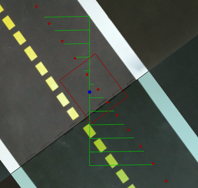
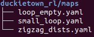

# Reinforcement Learning
This folder contains all the scripts required for the Reinforcement Learning based approach! 

- **<i>gym_duckietown/</i>**: My version of gym_duckietown package
- **<i>maps/</i>**: where the map info are stored 
- **<i>models/</i>**: This is where we store our trained (final)model! The model in this folder is used by `scripts/test_ddpg.py` & `scripts/evaluation.py`
- **<i>scripts/</i>**: where the training, testing scripts are. See [scripts/README](scripts/README.md) for more info
- `args.py`: where we set parameters related to training (e.g. batch size, ddpg parameters)
- `ddpg.py`: the implementation of DDPG
- `env.py`: includes the function that launches the environment
- `ornstein_uhlenbeck.py`: the implemenataion of OU Noise
- `utils.py`: the implementation of Replay Buffer & the evaluation done during training
- `wrappers.py`: image processing wrappers
  
--------------------------------------------------
<details>
<summary><b><i>gym_duckietown/</i></b></summary>

`gym_duckietown` is a Python package build on top of OpenAI's Gym. It is basically "the Simulator". You can find all the
scripts that creates the simulator; its physics, maps, objects, etc. This simulator was created as part of work done at [Mila](https://mila.quebec/).
The latest version of `gym_duckietown` can be found [on this link](https://github.com/duckietown/gym-duckietown/tree/daffy).
 
But in this folder I edited some scripts for my approach: `simulator.py` & `graphics.py`, to be specific. Here's my approach:
- **Sensor lines:** 

    The idea is to 'attach' distance sensors to the car where the sensor readings will correspond to the distance between
    the car and the center of the lane. Please refer to the following figure:
    
    
    

- **Reward Function:**


</details>

--------------------------------------------------
<details>
<summary><b><i>maps/</i></b></summary>

This is where we store our maps in which our RL agent will learn driving!
```shell script
tree challenge-aido_RL-IL/duckietown_rl/maps
``` 


We see that there are only 3 maps in this folder. That's because these are the most reasonable maps amongst the others, in my opinion.
Because these maps do not have any other car/duckiebot or any pedestrian. At the same time, they have all the features
required for learning how to drive; turns, straight roads, zigzags, etc. But these are not the only maps available within
the environment: see [tutorials/maps](../tutorials/maps) for more info.

</details>

--------------------------------------------------