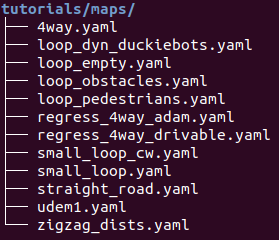
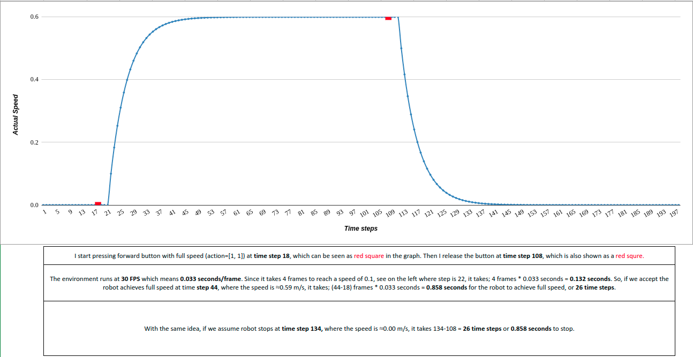

# Welcome to the Tutorials! 
This folder includes a bunch of Python scripts for you to get yourself familiarized with:
- Maps in the simulation that are used for the challenges
- Simulation and it's dynamics
- An agent/expert that drives itself (PID controller)
- A noise profile that's used in Reinforcement Learning training (DDPG)
- Train DDPG on [OpenAI's Cartpole](https://gym.openai.com/envs/CartPole-v0/)!

---
<details>
<summary><b><i>maps/</i></b></summary>

By the time this code is published, these are all the available maps we have in Duckietown:
```shell script
cd challenge-aido_RL-IL
tree tutorials/maps
``` 


Every map is stored in a `.yaml` file where each map is constructed tile-by-tile, as well as some objects such as; 
static & non-static Duckiebots, pedestrians, traffic lights, etc. Please see [this repository](https://github.com/duckietown/gym-duckietown#map-file-format) if you want to construct a
new map or want to get more information. In addition, check out this [great notebook](https://github.com/duckietown/duckietown-world/blob/daffy/notebooks/30-DuckietownWorld-maps.ipynb)
for a better and broader perspective on the maps available!

#### TODO: add "zigzag_dists" info image


</details>

---
<details>
<summary><b><i>get_good_sample_pose.py</i></b></summary>

This script outputs a 'good' starting position and angle for an agent, given a map. That means, agent starts at a point
that is close to the center of a lane and starts at an angle that is close to zero, which means agent is aligned with
the lane. Example usage:

```shell script
cd challenge-aido_RL-IL/tutorials
python get_good_sample_pose.py -m "zigzag_dists"
```
which returns the starting position of the car in `(x,y,z)` coordinates and the alignment with the lane in `degrees`
for the map `zigzag_dists`. e.g. Angle `0` means the car is perfectly aligned with the right-lane's center line. Angle `45` means the car needs to turn 45 degrees to be
aligned with the  right-lane's center line.

Keep it in mind that a map name has to be given as an argument(`-m` which stands for 'map')

</details>

---
<details>
<summary><b><i>get_dynamics.py</i></b></summary>

Let's get our hands dirty and play with the simulator/environment!
In other words, let's have a look at the dynamics of the simulator and try to get an answer to the
following questions:
- What's the full-speed of the our car/duckie-bot? 
- How many time-steps or seconds does it need to reach to full-speed? 
- Can we go backwards and what the max. speed we can reach while diriving to backwards?
- How many time-steps or seconds does it need to stop?

In order to answer some of the questions above, if not all, I performed a test where I manually control the car and
collect some data. 

Here's the processed version of the data collected from my test: 
> Please see the raw data and the graph [here](https://docs.google.com/spreadsheets/d/1Z7T850Boy9YJm9lRytTkmAFld-AV8DBCbTb3Lo4PRIM/edit?usp=sharing) for more information.

#### Take-aways:

- The full-speed is: `0.6 m/s` 
- It takes `≈0.858 seconds` or `≈26 time-steps` to reach to full-speed from `0 m/s`
- It takes `≈0.858 seconds` or `≈26 time-steps` to reach to `0 m/s` from full-speed(`0.6 m/s`)

These details will become important when building/training algorithms!
<details>

---
<summary><i><b>***</b> Click to see the <b>spoiler</b> where this will be important! <b>***</b></i></summary>

---

When training a reinforcement learning algorithm (the one we use is called DDPG) we let the agent apply the same action
for a fixed number of times, because it takes some time to achieve speed! That fixed number will be called `frame_skip`
which you will encounter when creating the simulator instance [as in here](https://github.com/rizavelioglu/challenge-aido_RL-IL/blob/82f84a31ce46585b97498ed56ee6d794e8bd0038/duckietown_rl/env.py#L5)! 
</details>

##### Important Note:

As soon as the script is executed, the data is getting aggregated. And once
"ENTER" is hit from the keyboard, then the data is saved to a file: `get_dynamics_raw.csv`  
Here the data collection is done manually, but it can also be done automatically, obviously:
- Initialize an environment in `straight_road` map 
- Generate a good sampling position to start in the map using `get_good_sample_pose.py`
- Create a dummy agent that applies the max. action to go full speed for a specified time-steps
- Collect all the data, store, process, and gather info!

</details>

---
<details>
<summary><b><i>PIDcontroller.py</i></b></summary>

This script implements a PID controller[, see Wikipedia for more info,](https://en.wikipedia.org/wiki/PID_controller) for the car to drive and
navigate itself within an environment. Go check out the code cause every line of code is explained!

#### Take-aways:

- The action space is in 2-d. That means an action is a 2-dimensional vector which corresponds to the left & right wheel
velocities.
- The structure of running an agent in a simulation shown in a pseudocode-ish way:
```shell script
Initialize the environment                                // Line [9]
Reset the environment and store observation               // Line [23]
Render the environment                                    // Line [25]
for 0 to EPISODES:                                        // Line [29]
    for 0 to STEPS:                                       // Line [35]
        Calculate the action according to your algorithm  // Line [69-71]
        Apply the action and store information            // Line [73]
        render the environment                            // Line [75]
    reset the environment                                 // Line [88]
```

##### Note:
The reason why we store only last 10 angle errors [[Line 31]](https://github.com/rizavelioglu/challenge-aido_RL-IL/blob/82f84a31ce46585b97498ed56ee6d794e8bd0038/tutorials/PIDcontroller.py#L31) is based on this [paper](https://www.robotshop.com/community/forum/t/pid-tutorials-for-line-following/13164)
</details>

---
<details>
<summary><b><i>get_tile_coordinates.py</i></b></summary>

This script runs the PID agent to get each of the tile coordinates in some of the maps available in `maps/` folder.
For simplicity, only some of the maps' tile data is collected,not all. In addition, some maps are preffered amongst
others due to simplifications in the chosen maps such as; there's no obstacle or no other car in the chosen maps, which
make things easier for us.

#### Why do we need this script?
We will need the tile coordinates data for constructing the feature vector which will be given to Reinforcement Learning
algorithm (DDPG) as input. Therefore, it is essential to have the tile coordinates of the maps where we are building our
approach to self-driving car. You can see that these maps are inside the `duckietown_rl/maps` folder.        

</details>

---
<details>
<summary><b><i>OU_action_noise.py</i></b></summary>

<i>"In Reinforcement learning for discrete action spaces, exploration is done via probabilistically selecting a random action
(such as epsilon-greedy or Boltzmann exploration). For continuous action spaces, exploration is done via adding noise to
the action itself. In the DDPG paper, the authors use Ornstein-Uhlenbeck Process to add noise to the action output
(Uhlenbeck & Ornstein, 1930)"</i> [[Source]](https://towardsdatascience.com/deep-deterministic-policy-gradients-explained-2d94655a9b7b)

<i>"The Ornstein-Uhlenbeck Process generates noise that is correlated with the previous noise, as to prevent the noise from
canceling out or “freezing” the overall dynamics"</i> [[Source]](https://www.quora.com/Why-do-we-use-the-Ornstein-Uhlenbeck-Process-in-the-exploration-of-DDPG/answer/Edouard-Leurent?ch=10&share=4b79f94f&srid=udNQP)

We will see OU noise in detail when we train a Reinforcement Learning agent using DDPG algorithm in `duckietown_rl/`. The purpose of this
script is just to get the user familiarized with OU noise. What this script does is that it generates an OU noise profile
and visualizes it. 

Example usage #1: Scatter plot & save the plot: `--save-img = 1`
```shell script
python OU_action_noise.py --mu 0 --sigma 0.2 --timesteps 1000 --reset-after 500 --save-img 1
```
Example usage #2: Line chart: `--line = 1` & don't save the image(default):
```shell script
python OU_action_noise.py --mu 0 --sigma 0.5 --timesteps 500 --reset-after 0 --line 1
```

You can find 2 saved plots in `images/` folder.

See the following links to get more info on OU Noise:
- [Wikipedia](https://en.wikipedia.org/wiki/Ornstein%E2%80%93Uhlenbeck_process)
- [Blogpost](https://towardsdatascience.com/deep-deterministic-policy-gradients-explained-2d94655a9b7b)


#### Take-aways:

- OU noise generates a noise that is correlated with the previous noise, until you reset it.
- Since we only have 2 wheels, hence 2 wheel velocities, 2 noise profile is generated: one for left wheel, and another
one for right wheel.

</details>

---
<details>
<summary><b><i>cartpole/</i></b></summary>

##TODO:explain cartpole (put a better model in cartpole/models)

</details>

---